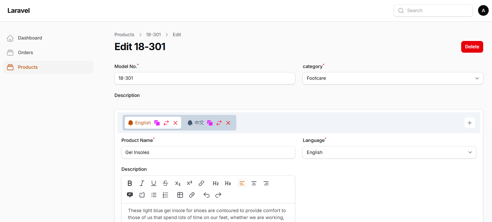
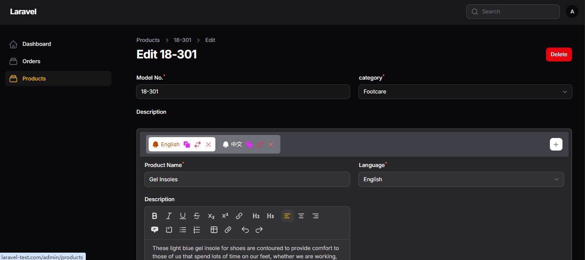

# Display Repeater as Tab





`TabRepeater` is a custom form component for Filament v4/v5 that replaces the standard Repeater UI with a clean, horizontal tabbed interface.

It preserves all native Filament Repeater functionality—such as cloning, deleting, adding, and reordering—while dramatically improving the layout for multi-field dynamic items.

## Key Features

- Dynamic Icons: Assign static icons or evaluate dynamic icons based on item state .

- Drag-and-Drop Tab Sorting: Drag tab headers horizontally to reorder items seamlessly with backend Livewire state sync.

- Form State Compatibility: Built directly on top of Filament's Repeater component class, maintaining native form state handling.

## Installation

You can install the package via composer:

```bash
composer require icetalker/filament-tab-repeater
```

You can publish the views using

```bash
php artisan vendor:publish --tag="filament-tab-repeater-views"
```

## Usage

### Basic Usage

```php
use Icetalker\FilamentTabRepeater\Forms\Components\TabRepeater;
use Filament\Forms\Components\TextInput;
use Filament\Forms\Components\Select;
use Filament\Forms\Components\RichEditor;

$languages = [
    'en' => 'English',
    'zh-CN' => '中文'
];

TabRepeater::make('translations')
    ->relationship('translations')
    ->schema([
        Select::make('language_code')
            ->label('Language')
            ->options($languages)
            ->required(),
        TextInput::make('product_name')
            ->required(),
        RichEditor::make('description'),
    ])
    ->label('Description')
    ->columns(2)
    ->itemIcon('heroicon-m-bell')
    ->itemLabel(fn (array $state) => isset($state['language_code']) ? $languages[$state['language_code']] : 'New Translation')，

```

### Advanced Options

#### Dynamic Tab Icons

Use `itemIcon()` to supply a static Heroicon name or pass a Closure to evaluate icons dynamically based on form input:

```php
use App\Forms\Components\TabRepeater;
use Filament\Forms\Components\Select;
use Filament\Forms\Components\TextInput;
use Filament\Support\Icons\Heroicon;

TabRepeater::make('social_links')
    ->schema([
        Select::make('platform')
            ->options([
                'github' => 'GitHub',
                'twitter' => 'Twitter',
                'linkedin' => 'LinkedIn',
            ])
            ->live(), // Re-evaluates icon when selection changes
        TextInput::make('url')->url()->required(),
    ])
    ->itemLabel(fn (array $state) => ucfirst($state['platform'] ?? 'New Link'))
    ->itemIcon(function (array $state) {
        return match ($state['platform'] ?? null) {
            'github' => Heroicon::OutlinedCodeBracket,
            'twitter' => Heroicon::OutlinedChatBubbleLeftRight,
            'linkedin' => Heroicon::OutlinedBriefcase,
            default => Heroicon::OutlinedLink,
        };
    })

```

#### Enabling or Disabling Drag-and-Drop Sorting

Reordering is enabled by default. Control it using standard Repeater methods:

```php

TabRepeater::make('items')
    ->reorderable(true) // Enable drag-and-drop tab headers
    // OR
    ->reorderable(false) // Disable tab reordering

```

## Use Case

Here are the most compelling real-world use cases where a TabRepeater outperforms Filament’s standard stacked Repeater:

1. Multilingual / Content Localization (i18n)

The Challenge: When managing multi-language content (e.g., blog posts, products, or SEO meta titles/descriptions in English, Spanish, German, and Chinese), a standard repeater creates a massive, scrolling vertical form.

Why `TabRepeater` Wins: Each language gets its own clean tab with a flag or language icon, keeping the interface compact and focused on one locale at a time.

```php
use App\Forms\Components\TabRepeater;
use Filament\Forms\Components\Select;
use Filament\Forms\Components\TextInput;
use Filament\Support\Icons\Heroicon;

TabRepeater::make('translations')
    ->label('Translations')
    ->itemLabel(fn (array $state) => strtoupper($state['locale'] ?? 'New Locale'))
    ->itemIcon(Heroicon::Language)
    ->schema([
        Select::make('locale')
            ->options([
                'en' => 'English',
                'es' => 'Spanish',
                'de' => 'German',
            ])
            ->required()
            ->live(),
        TextInput::make('title')->required(),
        RichEditor::make('description')->rows(4),
        TextInput::make('seo_title'),
        Textarea::make('seo_description'),
    ])

```

2. E-Commerce Product Variants & Custom Options

- The Challenge: Configuring complex SKU variants (e.g., Size + Color combos, Custom Apparel Options, or Pet Accessories) requires dozens of fields per variant: Price, Sale Price, SKU, Stock, Dimensions, Images, and Custom Attributes. Standard repeaters quickly turn into a wall of inputs.

- Why TabRepeater Wins: Merchants can click through tabs like "Large / Red", "Medium / Blue", drag tabs to reorder display hierarchy, and identify active inventory items at a glance.

```php

TabRepeater::make('variants')
    ->label('Product Variants')
    ->itemLabel(fn (array $state) => $state['sku'] ?? $state['name'] ?? 'New Variant')
    ->itemIcon(Heroicon::OutlinedTag)
    ->schema([
        TextInput::make('name')->placeholder('e.g., Large / Black')->live(onBlur: true),
        TextInput::make('sku')->required(),
        Grid::make(2)->schema([
            TextInput::make('price')->numeric()->prefix('$')->required(),
            TextInput::make('stock')->numeric()->required(),
        ]),
        FileUpload::make('images')->multiple()->directory('product-variants'),
    ])

```

3. Hero Sliders & Banner Management

- The Challenge: Homepage slider blocks typically include a desktop image, mobile image, heading, subheading, CTA button text, CTA URL, overlay opacity, and slide order.

- Why TabRepeater Wins: Sorting horizontal slides via drag-and-drop tab headers feels much more natural for content editors than dragging long vertical cards.

```php
TabRepeater::make('slides')
    ->label('Homepage Banner Slides')
    ->itemLabel(fn (array $state) => $state['heading'] ?? 'Slide Title')
    ->itemIcon(Heroicon::OutlinedPhoto)
    ->schema([
        TextInput::make('heading')->live(onBlur: true),
        TextInput::make('cta_text'),
        TextInput::make('cta_url')->url(),
        FileUpload::make('desktop_image')->image()->required(),
        FileUpload::make('mobile_image')->image(),
    ])
```

4. Pricing Tiers & Subscription Plans

- The Challenge: Managing SaaS or membership tiers (e.g., Basic, Pro, Enterprise) involves deep schemas: tier name, monthly price, annual price, feature checklist, highlight badges, and limits.

- Why TabRepeater Wins: Editors can quickly compare side-by-side settings across "Basic", "Pro", and "Enterprise" by clicking between tabs rather than scrolling up and down a long page.

```php
TabRepeater::make('plans')
    ->label('Subscription Plans')
    ->itemLabel(fn (array $state) => $state['name'] ?? 'Plan')
    ->itemIcon(fn (array $state) => match($state['badge'] ?? null) {
        'popular' => Heroicon::OutlinedStar,
        'enterprise' => Heroicon::OutlinedBuildingOffice,
        default => Heroicon::OutlinedCreditCard,
    })
    ->schema([
        TextInput::make('name')->live(onBlur: true)->required(),
        TextInput::make('price_monthly')->numeric()->prefix('$'),
        TextInput::make('price_yearly')->numeric()->prefix('$'),
        TagsInput::make('features')->placeholder('Add a feature'),
    ])
```

5. Multi-Branch / Store LocationsThe Challenge: 

- Businesses managing regional offices or store locations need to input operating hours, addresses, store managers, contact details, and custom map coordinates for each branch.

- Why TabRepeater Wins: Admins see branch names cleanly organized across the tab bar ("New York Branch", "London Branch", "Tokyo Branch") with error badges alerting them if mandatory fields are missing in a specific location.

## Feature Comparison

|Feature Need | Standard `Repeater` | `TabRepeater` |
|-------------|---------------------|-------------|
|Deep Sub-schemas (5+ fields per item)|❌ Long vertical page scrolling| ✅ Compact horizontal isolation|
|High Item Count (8+ items)|❌ Overwhelming UI |✅ Scrollable tab header bar|
|Visual Organization |❌ Uniform stacked boxes |✅ Tab labels with dynamic icons|
|Reordering↕️ | Vertical drag |↔️ Horizontal drag-and-drop|